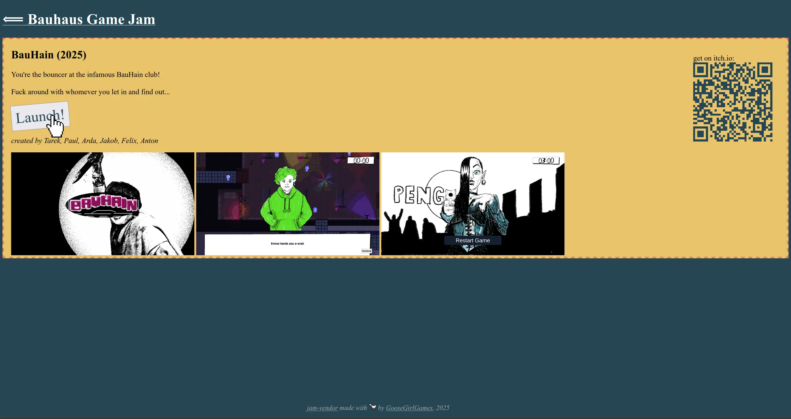

# jam-vendor

**jam-vendor** is a launcher system designed for showcasing multiple
small games on a single computer.  think of a vending machine selling
a bunch of little game jam games.

the list of games is configured in `games.json`.  use `wine` for windows
builds.

**jam-vendor** is powered by a server written in python.  start it by
running `./server.py` it starts a websocket server to which clients can
connect and send commands that will launch games.  after a configurable
idle time, games will close automatically.

a simple html frontend is provided.  launch a python-webserver with
`python -m http.server` and navigate to
http://127.0.0.1:1337/frontend.html.

<a href="img/vendor-main.webp"></img></a>
<a href="img/vendor-detail.webp"></img></a>

    <i>made with 🪿 by GooseGirlGames</i>

